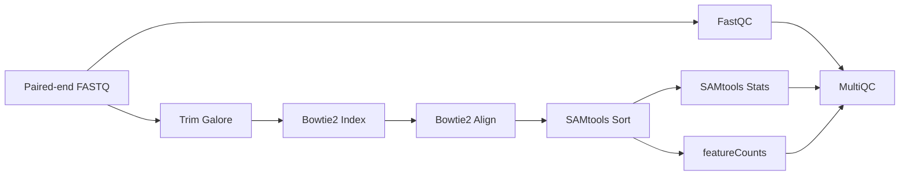

# ProkaryoticRnaSeq

[](https://www.nextflow.io/)
[](https://www.nextflow.io/docs/latest/dsl2.html)
[](https://www.docker.com/)
[](LICENSE)

A modular, containerized **Nextflow DSL2 pipeline for end-to-end prokaryotic RNA-Seq analysis**.

This workflow performs quality control, trimming, genome indexing, alignment, sorting, quantification, and consolidated QC reporting using reproducible BioContainers.

---

#  Overview

`prokRNAseq` is designed for:

* Prokaryotic RNA-Seq (paired-end Illumina)
* Reproducible containerized execution
* Modular DSL2 structure
* Portable execution (local, cloud, GitHub Codespaces)

---

# Workflow Diagram



---

# Pipeline Structure

```
prokRNAseq/
├── main.nf
├── nextflow.config
├── modules/
│   ├── qc/
│   ├── trimming/
│   ├── alignment/
│   ├── stats/
│   └── counting/
├── results/
└── README.md
```

The pipeline follows a fully modular **Nextflow DSL2 architecture**, allowing easy extension and maintenance.

---

# Requirements

| Tool     | Version            |
| -------- | ------------------ |
| Nextflow | ≥ 22.x             |
| Docker   | ≥ 20.x             |
| RAM      | ≥ 4 GB recommended |

Verify installation:

```bash
nextflow -version
docker --version
```

---

# Input Requirements

## 1️ Paired-End FASTQ Files

Place files in:

```
data/fastq/
```

Accepted naming:

```
sample_1.fastq.gz
sample_2.fastq.gz
```

or

```
sample_R1.fastq.gz
sample_R2.fastq.gz
```

Configured via:

```groovy
params.reads = "data/fastq/*_{1,2}.fastq.gz"
```

---

## 2️ Reference Genome (FASTA)

```
data/genome.fna
```

```groovy
params.genome_fasta = "data/genome.fna"
```

Bowtie2 index is generated automatically.

---

## 3️ Annotation File (GFF/GTF)

```
data/annotation.gff
```

```groovy
params.annotation = "data/annotation.gff"
```

For prokaryotes:

* Feature type: `gene`
* Attribute key: `ID=`

---

# Usage

## Basic Run

```bash
nextflow run main.nf
```

## Resume

```bash
nextflow run main.nf -resume
```

## Custom Parameters

```bash
nextflow run main.nf \
  --reads "data/fastq/*_{1,2}.fastq.gz" \
  --genome_fasta "data/genome.fna" \
  --annotation "data/annotation.gff"
```

---

# Output

All results are written to:

```
results/
```

## QC

* FastQC reports
* MultiQC consolidated report

## Alignment

* Sorted BAM files
* Alignment statistics

## Quantification

* `gene_counts.txt`
* `gene_counts.txt.summary`

---

# Reproducibility

Each module runs in dedicated BioContainers:

| Tool        | Container                         |
| ----------- | --------------------------------- |
| FastQC      | quay.io/biocontainers/fastqc      |
| Trim Galore | quay.io/biocontainers/trim-galore |
| Bowtie2     | quay.io/biocontainers/bowtie2     |
| SAMtools    | quay.io/biocontainers/samtools    |
| Subread     | quay.io/biocontainers/subread     |
| MultiQC     | quay.io/biocontainers/multiqc     |

This guarantees full environment reproducibility.

---

# Key Parameters

| Parameter        | Description             | Default      |
| ---------------- | ----------------------- | ------------ |
| `--reads`        | Input FASTQ pattern     | data/fastq/* |
| `--genome_fasta` | Reference genome FASTA  | required     |
| `--annotation`   | GFF/GTF annotation      | required     |
| `--outdir`       | Output directory        | results      |
| `--threads`      | CPU threads per process | 2            |

---

# Planned Extensions

* Differential expression (DESeq2 module)
* Strand-specific support
* Transcript-level quantification
* CI testing integration
* nf-core style schema validation
* Cloud execution profiles (AWS/GCP)

---

# Citation

If you use this pipeline in your research, please cite:

```
Jenifer, H.M. (2025). prokRNAseq: A modular Nextflow DSL2 pipeline
for prokaryotic RNA-Seq analysis. GitHub.
https://github.com/jkbomics/ProkaryoticRnaSeq
```

---

# Author

**Helga Jenifer M**
```
Bioinformatician 
jkbomics@gmail.com
```
---

# Contributing

Pull requests and issues are welcome.

